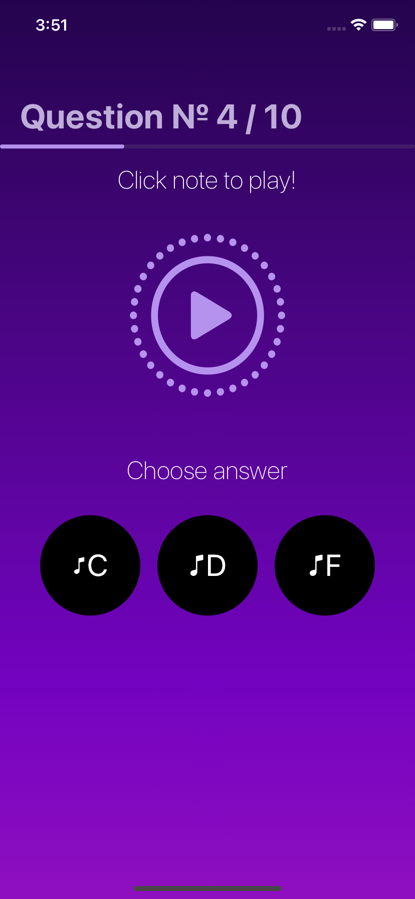
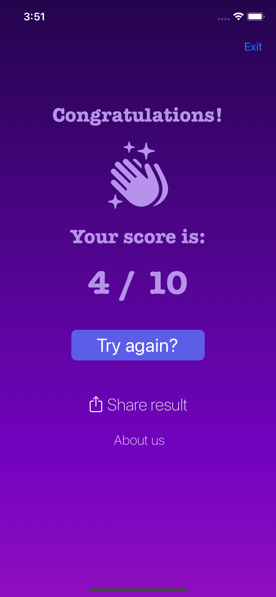
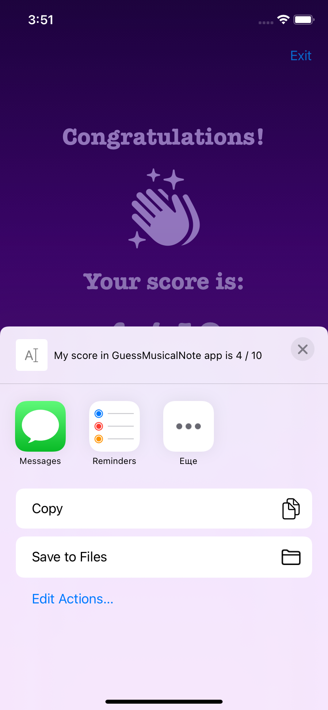
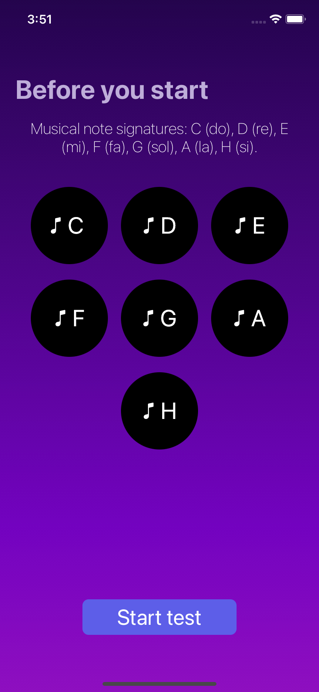
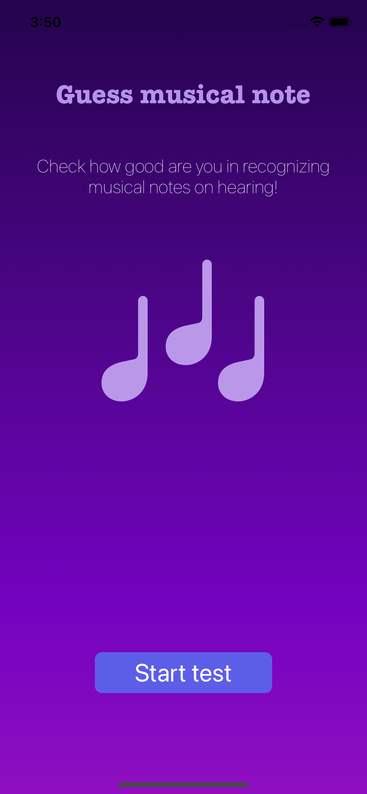
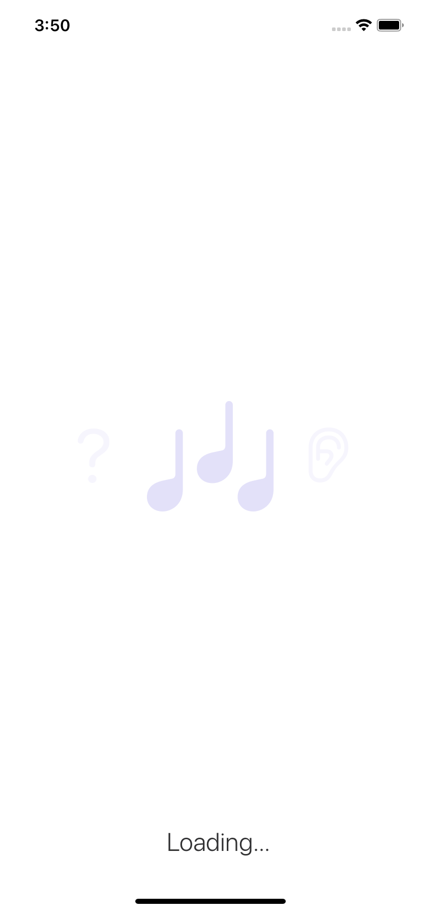

# Musicality
Application to guess the notes. Before the test, it is proposed to listen to their sound.

## Features

- UIKit, Storyboards
- Alert controller
- Sharing
- Sounds on the app

## Screenshots

  
  
  

  
  
  

  

 [demo](https://drive.google.com/file/d/1yb-Wp12hToPgrLMfUMrlGNT2Opu3dw3a/view?usp=sharing)

## 🛠 Skills
UIKit, Storyboards, Alert controller, Share, work with sounds

## Authors

- [@kaledinaoksana](https://github.com/kaledinaoksana) iOS developer 
- [@Vanakoff](https://github.com/Vanakoff) UI/UX designer

## 🔗 Links

